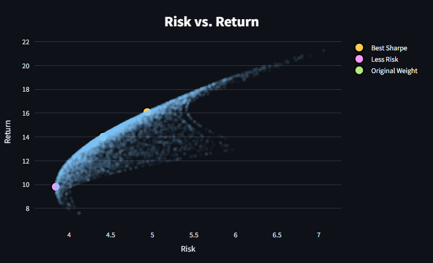
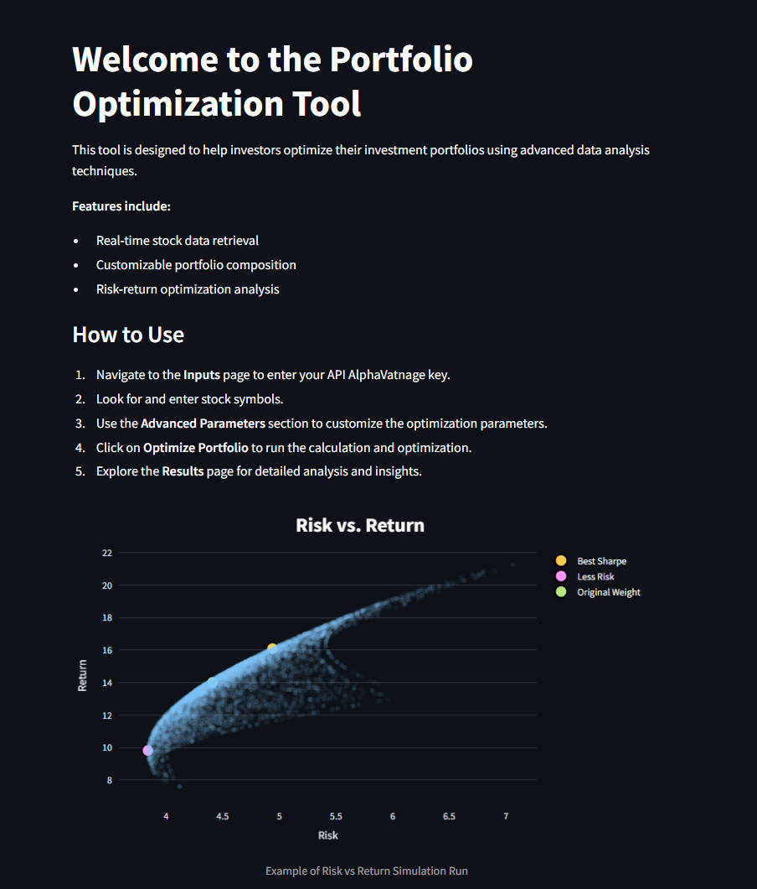
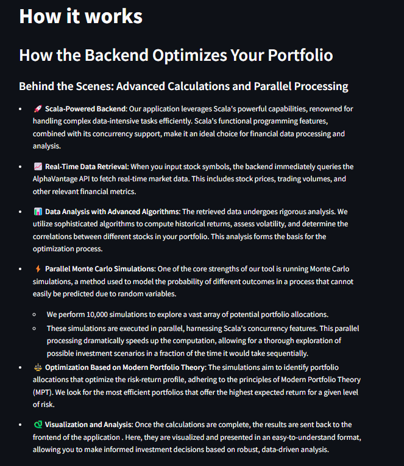
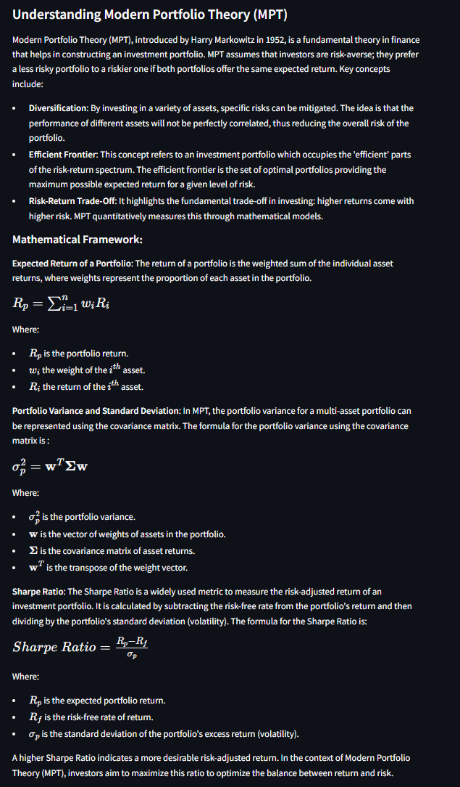
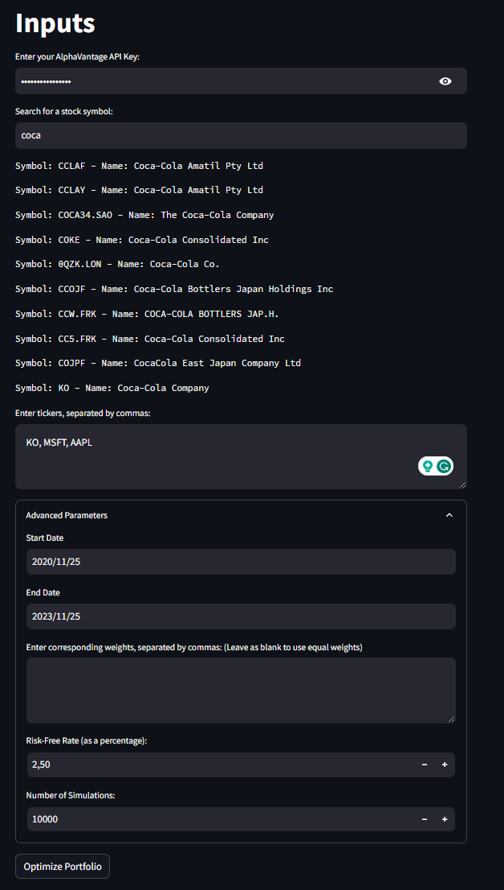
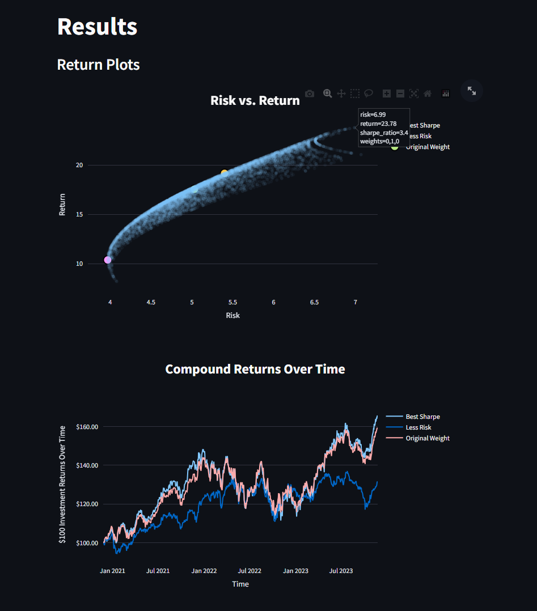
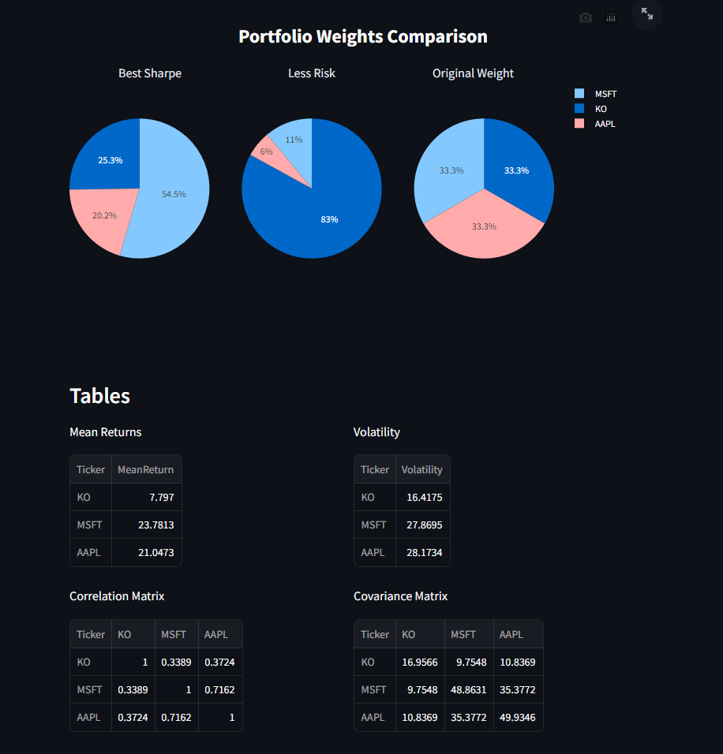
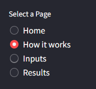
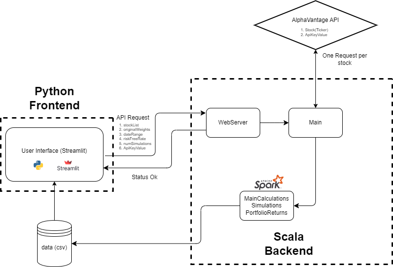

# Portfolio Optimization Tool

## Introduction
This Portfolio Optimization Tool is designed to help investors create an efficient portfolio using Modern Portfolio Theory (MPT). It leverages a Scala backend for heavy-duty data processing and Python with Streamlit for an interactive front-end experience.



## Features
- Real-time stock data retrieval from AlphaVantage API.
- Sophisticated algorithms to calculate historical returns, volatility, and stock correlations.
- Execution of 10,000 Monte Carlo simulations in parallel to optimize the portfolio.
- Visualization of the optimized portfolio and statistical analysis using Python and Streamlit.

## How It Works
1. **Scala Backend**: Performs data retrieval, analysis, and simulation.
   - Utilizes functional programming and concurrency for efficient processing.
   - Runs Monte Carlo simulations in parallel to optimize computation time.
2. **Python and Streamlit Frontend**: For interactive user experience and data visualization.
   - Implements intuitive UI for input and result presentation.
   - Uses Python's rich data science libraries for dynamic visualizations.

## Quick Start
Clone the repository and navigate to the project directory:

```bash
git clone https://github.com/yuri-gilferreira/scala-portfolio.git
cd scala-portfolio
```

### Install Dependencies


#### Java
Scala and sbt run on the Java Virtual Machine (JVM), so you'll need Java installed:
- You can download Java from [Oracle's Java Downloads](https://www.oracle.com/java/technologies/javase-downloads.html) or use an open-source alternative like [AdoptOpenJDK](https://adoptopenjdk.net/).
- Set the `JAVA_HOME` environment variable to your Java installation directory.
- Verify your installation by running `java -version` in the command line.

#### Scala Backend
Ensure you have Scala and sbt installed. If not, follow the instructions here:
- [Scala Installation Guide](https://www.scala-lang.org/download/)
- [sbt Installation Guide](https://www.scala-sbt.org/download.html)

#### Python and Streamlit Frontend
Ensure you have Python installed (Version 3.10.9). Then, install the required Python packages, including Streamlit:

```bash
python -m pip install -r frontend/requirements.txt
```


To run the Portfolio Optimization Tool, you need to start both the Scala backend and the Python Streamlit frontend.

### Start the Scala Backend

1. **Navigate to the Scala Backend Directory**:
   Open a terminal and change to the directory containing the Scala application.

   ```bash
   cd backend
   ```

2. **Run the scala server:**

   ```bash
   sbt "runMain com.YuriFerreira.PortfolioOptimization.WebServer"
   ```

   Your server should be online at port 8080 and waiting for requests. Leave this terminal open!

### Start the Python Streamlit Frontend

1. **Open a new terminal window:**
This is necessary to keep the Scala server running in the background.

2. **Navigate to the Python Frontend Directory:**

   ```bash
   cd frontend/src/
   ```
3. **Start Streamlit Application**
Start the Streamlit application using the following command:

   ```bash
   streamlit run app.py
   ```

Streamlit will automatically open a new tab in your default web browser, or you can manually access it typically at http://localhost:8501.

### Accessing the Application
Once both the Scala backend and the Streamlit frontend are running, you can interact with the Portfolio Optimization Tool via the web interface opened by Streamlit in your browser. Typically, the Streamlit application will be accessible at `http://localhost:8501`.

## Usage

The Portfolio Optimization Tool is designed with a user-friendly interface comprising four main tabs, each offering distinct functionalities and insights.

### 1. Home Tab
The Home tab serves as the introduction and guide to the application:

- **Welcome Message**: A brief introduction and overview of the Portfolio Optimization Tool.
- **Features Included**: Summary of key features available in the tool.
- **How to Use**: Basic instructions on navigating and utilizing the application effectively.
- **Contact Information**: Details for support or additional information.



### 2. How It Works Tab
This tab provides insights into the technical and theoretical aspects of the tool:

- **How the Backend Works**: Explanation of the backend processes, data handling, and computation methods.



- **Understanding Modern Portfolio Theory (MPT)**: A brief overview of MPT principles and how they are applied in the tool.



### 3. Inputs Tab
Here, users can input the necessary data for portfolio optimization:

- **AlphaVantage API Key**: Field to input your AlphaVantage API key for real-time stock data retrieval.
- **Search for Stock Symbols**: Option to search and select specific stock symbols for analysis.
- **Tickers**: Input field for entering stock tickers, separated by commas.
- **Advanced Parameters**: Options to set advanced parameters like date range, portfolio weights, risk-free rate, and the number of simulations.



### 4. Results Tab
The Results tab presents the outcome of the portfolio optimization in various formats:

- **Plots**:
  - Risk vs Return for all simulations, highlighting the portfolios with the best Sharpe ratio, least risk, and original weight.
  - Compound Returns Overtime for the best Sharpe ratio portfolio, least risk portfolio, and the portfolio with original weight.
  - Portfolio Weight Comparison across different portfolios.




- **Tables**:
  - Mean Annualized Returns for each stock in the portfolio.
  - Annualized Volatility of the portfolio.
  - Correlation Matrix showing the relationships between different stocks.
  - Covariance Matrix of the stock returns.

  

<table>
<tr>
<td>

### Navigating Through the Application
Navigation through the application is done using the sidebar, which allows you to easily switch between different tabs. Each tab provides a unique aspect of portfolio analysis and optimization, guiding you through the entire process step by step.

</td>
<td>



</td>
</tr>
</table>


## Architecture Diagram


Below is the architecture diagram of the Portfolio Optimization Tool. This diagram provides an overview of how the various components of the application interact with each other, including the Scala backend, Python Streamlit frontend, and external data sources.



## Folder Structure

```bash

+---backend
|   |   build.sbt
|   +---project
|   |   |   assembly.sbt
|   |   |   Dependencies.scala
|   +---src
|   |   +---main
|   |   |   \---scala
|   |   |           ApiCalls.scala
|   |   |           JsonFormats.scala
|   |   |           Main.scala
|   |   |           MainCalculations.scala
|   |   |           PortfolioReturns.scala
|   |   |           Simulations.scala
|   |   |           SparkFunctions.scala
|   |   |           WebServer.scala       
|   |   \---test
|   |       \---scala
|   |               ApiCallsTest.scala
|   |               JsonFormatsTest.scala
|   |               MainCalculationsTest.scala
|   |               PortfolioReturnsTest.scala
|   |               SimulationsTest.scala.scala
|   |               TestUtils.scala
|   |               WebServerTest.scala
|   |               
+---data
|       .gitkeep
|       
+---frontend
|   |   requirements.txt
|   |   __init__.py
|   |   
|   \---src
|       |   app.py
|       |   home.py
|       |   inputs.py
|       |   intro.py
|       |   results.py
|       |   utils.py
|       |   __init__.py
|               
\---resources
        diagram.png
        risk_return.png
        

```

## License

This project is licensed under the MIT License - see the [LICENSE](LICENSE) file for details. The MIT License is a permissive license that is short and to the point. It lets people do anything they want with your code as long as they provide attribution back to you and don’t hold you liable.

## Contact

For support or inquiries about the Portfolio Optimization Tool, feel free to reach out. You can contact me in the following ways:

- **Email**: [yuri.gferreira16@gmail.com](mailto:yuri.gferreira16@gmail.com)
- **LinkedIn**: [Yuri Gil Ferreira's LinkedIn](https://www.linkedin.com/in/yuri-ferreira-354a07154/) 

Feel free to connect or follow for updates on this project and others, or for any questions and professional inquiries.
